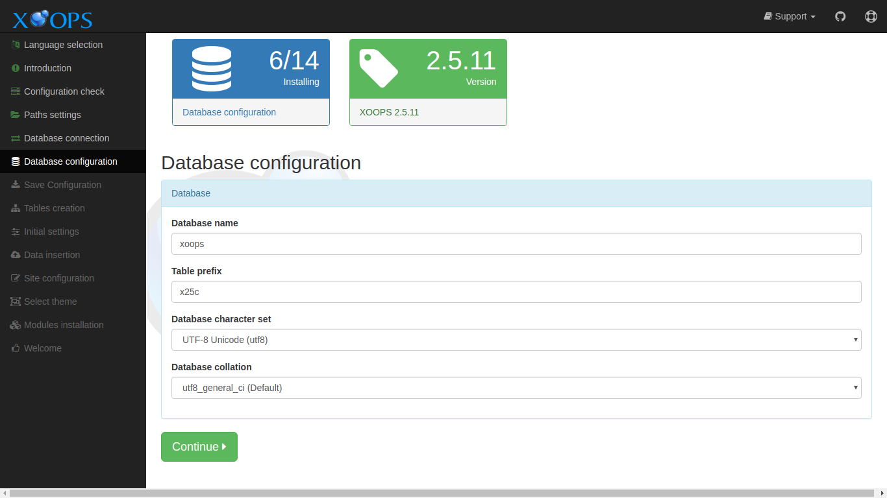

# Database Configuration​

This page collects the information about the database that XOOPS will use.

After entering the requested information and correcting any issues, select the "Continue" button to proceed.

## Data Collected in This Step

### Database

#### Database name

The name of database on the host that XOOPS should use. The database user entered in the previous step should have all privileges on this database. The installer will attempt to create this database if does not exist.

#### Table prefix

This prefix will be added to the names of all new tables created by XOOPS. This helps avoid name conflicts if the database is shared with other applications. A unique prefix also makes is more difficult to guess table names, which has security benefits. If you are unsure, just keep the default

#### Database character set

The installer defaults to `utf8mb4`, which supports the full Unicode range including emoji and supplementary characters. You can select a different character set here, but `utf8mb4` is recommended for virtually all languages and locales and should be left as-is unless you have a specific reason to change it.

#### Database collation

The collation field is left blank by default. When blank, MySQL applies the default collation for whichever character set was selected above \(for `utf8mb4` this is typically `utf8mb4_general_ci` or `utf8mb4_0900_ai_ci`, depending on the MySQL version\). If you need a specific collation — for example to match an existing database — select it here. Otherwise, leaving it blank is the recommended choice.

