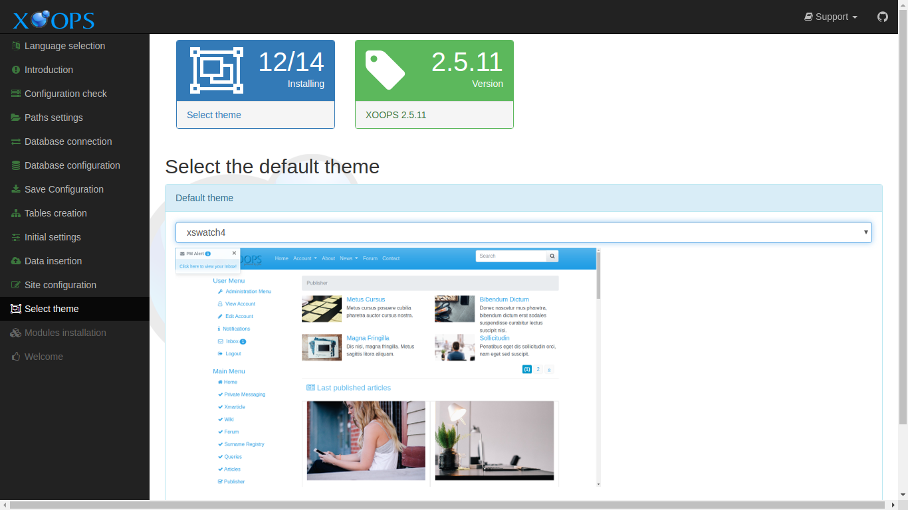

# Select Theme​

This page collects your choice for the initial theme for your new site. Themes control the visual character of your site. Themes may be changed at any time, if desired.

After entering the requested information and correcting any issues, select the "Continue" button to proceed.

## Data Collected in This Step

### Select the default theme

#### Default theme

Select an initial theme for your site from the list. A screenshot of each theme is shown as it is selected.

XOOPS 2.7.0 ships with several front-end themes out of the box:

* **default** — a minimal baseline theme, useful as a starting point for customization.
* **xbootstrap5** — Bootstrap 5 theme, recommended for most new sites.
* **xswatch5** — Bootswatch 5 variants; a set of styled sub-themes on top of Bootstrap 5.
* **xtailwind** — Tailwind CSS-based theme + DaisyUI with 35 palettes and Alpine.js interactivity
* **xtailwind2** — art-directed sibling theme with curated palettes and refined module styling

You can change the theme at any time from the administration area, and additional themes can be uploaded to the `themes/` directory.

