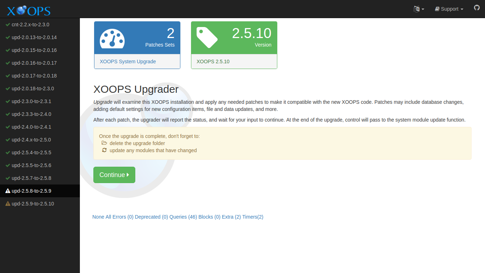
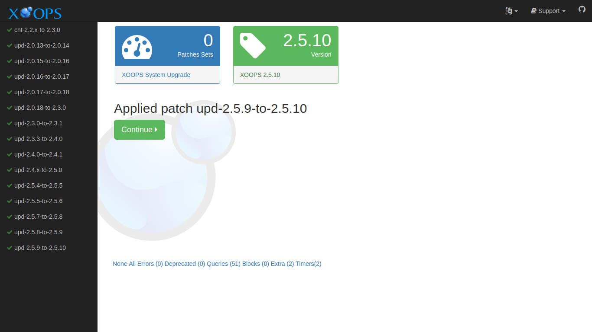
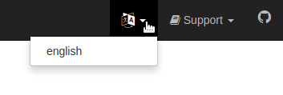

# Running Upgrade

Before running the main upgrader, make sure you have completed the [Preflight Check](preflight.md). The upgrade UI requires preflight to be run at least once and will direct you there if you have not.

Launch the upgrade by pointing your browser to the _upgrade_ directory of your site:

```text
http://example.com/upgrade/
```

This should show a page like this:



Select the "Continue" button to proceed.

Each "Continue" advances through another patch. Keep continuing until all patches are applied, and the System Module Update page is presented.



## What the 2.5.11 → 2.7.0 Upgrade Applies

When upgrading from XOOPS 2.5.11 to 2.7.0, the upgrader applies the following patches. Each is presented as a separate step in the wizard so you can confirm what is being changed:

1. **Remove obsolete bundled PHPMailer.** The bundled copy of PHPMailer inside the Protector module is deleted. PHPMailer is now supplied through Composer in `xoops_lib/vendor/`.
2. **Remove obsolete HTMLPurifier folder.** Similarly, the old HTMLPurifier folder inside the Protector module is deleted. HTMLPurifier is now supplied through Composer.
3. **Create the `tokens` table.** A new `tokens` table is added for generic scoped token storage. The table has columns for token id, user id, scope, hash, and issued/expires/used timestamps, and is used by token-based features in XOOPS 2.7.0.
4. **Widen `bannerclient.passwd`.** The `bannerclient.passwd` column is widened to `VARCHAR(255)` so it can store modern password hashes (bcrypt, argon2) instead of the legacy narrow column.
5. **Add session cookie preferences.** Two new preferences are inserted: `session_cookie_samesite` (for the SameSite cookie attribute) and `session_cookie_secure` (to force HTTPS-only cookies). See [After the Upgrade](ustep-04.md) for how to review these after the upgrade completes.

None of these steps touch your content data. Your users, posts, images, and module data remain untouched.

## Choosing a Language

The main XOOPS distribution comes with English support. Support for additional locales is supplied by [XOOPS Local support sites](https://xoops.org/modules/xoopspartners/). This support can come in the form of a customized distribution, or additional files to add to the main distribution.

XOOPS translations are maintained on [transifex](https://www.transifex.com/xoops/public/)

If your XOOPS Upgrader has additional language support, you can change the language by selecting the language icon in the top menus, and choosing a different language.



