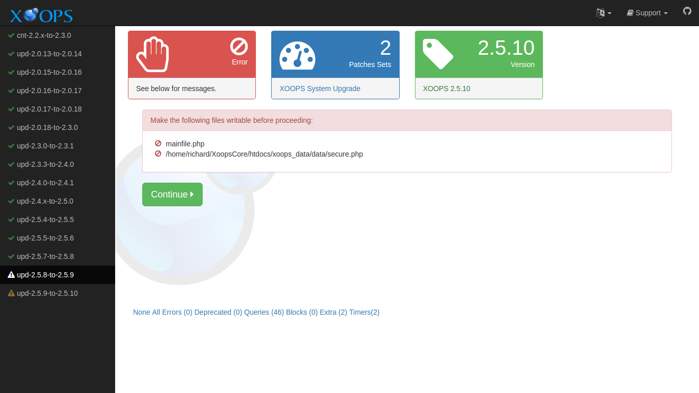
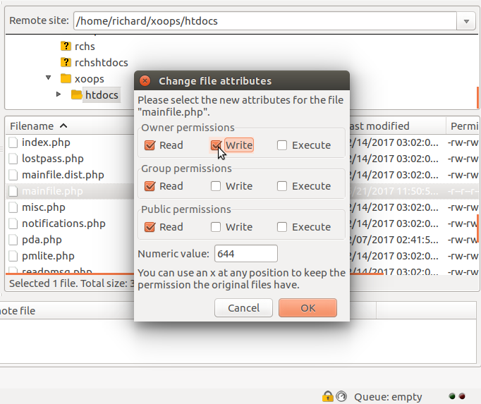

# Troubleshooting​

## Smarty 4 Template Errors

The most common class of problems when upgrading from XOOPS 2.5.x to 2.7.0 is Smarty 4 template incompatibility. If you skipped or did not complete the [Preflight Check](preflight.md), you may see template errors on the front end or in the admin area after the upgrade.

To recover:

1. **Re-run the preflight scanner** at `/upgrade/preflight.php`. Apply any automatic repairs it offers, or fix flagged templates manually.
2. **Clear the compiled template cache.** Remove everything except `index.html` from `xoops_data/caches/smarty_compile/`. Smarty 3 compiled templates are not compatible with Smarty 4 and stale files can cause confusing errors.
3. **Switch to a shipped theme temporarily.** From the admin area, select `xbootstrap5` or `default` as the active theme. This will confirm whether the problem is limited to a custom theme or is site-wide.
4. **Validate any custom themes and module templates** before switching production traffic back on. Pay particular attention to templates that use `{php}` blocks, deprecated modifiers, or non-standard delimiter syntax — these are the most common Smarty 4 breakages.

See also the Smarty 4 section in [Special Topics](../../installation/specialtopics.md).

## Permission Issues

The XOOPS Upgrade may need to write to files that have previously been made read-only. If this is the case, you will see a message like this:



The solution is to change the permissions. You can change permissions using FTP if you do not have more direct access. Here is an example using FileZilla:



## Debugging Output

You can enable extra debugging output in the logger by adding a debug parameter to the URL used to launch the Upgrade:

```text
http://example.com/upgrade/?debug=1
```

