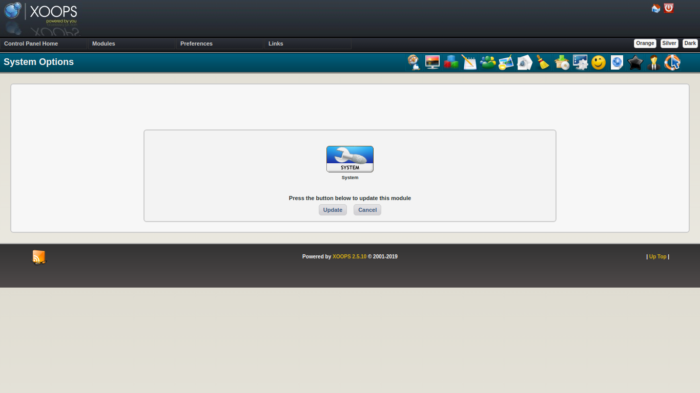
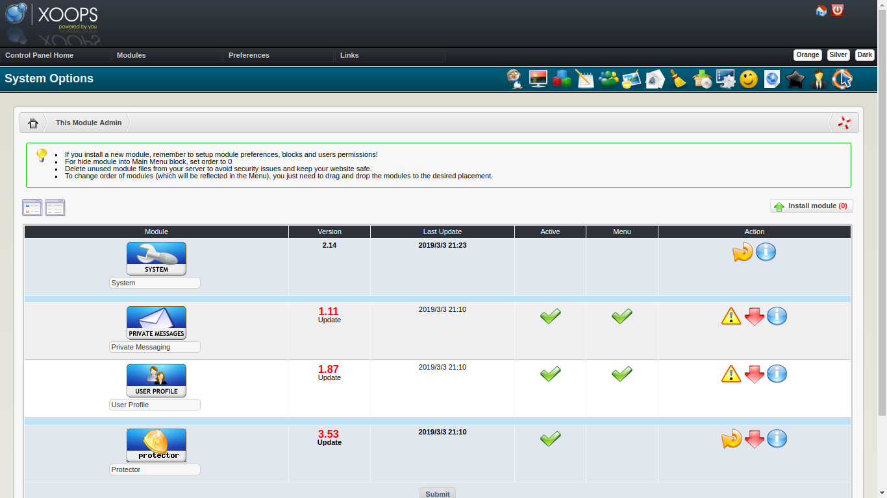

# ​After the Upgrade​

## Update the System Module

After all needed patches have been applied, selecting _Continue_ will set everything up to update the **system** module. This is a very important step and is required to complete the upgrade properly.

Select _Update_ to perform the update of System module.

## Update Other XOOPS Supplied Modules

XOOPS ships with three optional modules - pm \(Private Messaging,\) profile \(User Profile\) and protector \(Protector\) You should do an update on any of these modules that are installed.

## Update Other Modules

It is likely that there are updates to other modules that might enable the modules to work better under your now updated XOOPS. You should investigate and apply any appropriate module updates.

## Review New Cookie Hardening Preferences

The XOOPS 2.7.0 upgrade adds two new preferences that control how session cookies are issued:

* **`session_cookie_samesite`** — controls the SameSite cookie attribute. `Lax` is a safe default for most sites. Use `Strict` for maximum protection if your site does not rely on cross-origin navigation. `None` is only appropriate if you know you need it.
* **`session_cookie_secure`** — when enabled, the session cookie is only sent over HTTPS connections. Turn this on if your site runs on HTTPS.

You can review these settings under System Options → Preferences → General Settings.

## Validate Custom Themes

If your site uses a custom theme, walk through the front end and admin area to confirm that pages render correctly. The upgrade to Smarty 4 may affect custom templates even if the preflight scan passed. If you see rendering problems, revisit [Troubleshooting](ustep-03.md).

## Clean Up Installation and Upgrade Files

For security, remove these directories from your web root once the upgrade is confirmed working:

* `upgrade/` — the upgrade workflow directory
* `install/` — if present, either as `install/` or as a renamed `installremove*` directory

Leaving these in place exposes the upgrade and installation scripts to anyone who can reach your site.

## Open Your Site

If you followed the advice to _Turn your site off_, you should turn it back on once you have determined it is working correctly.

